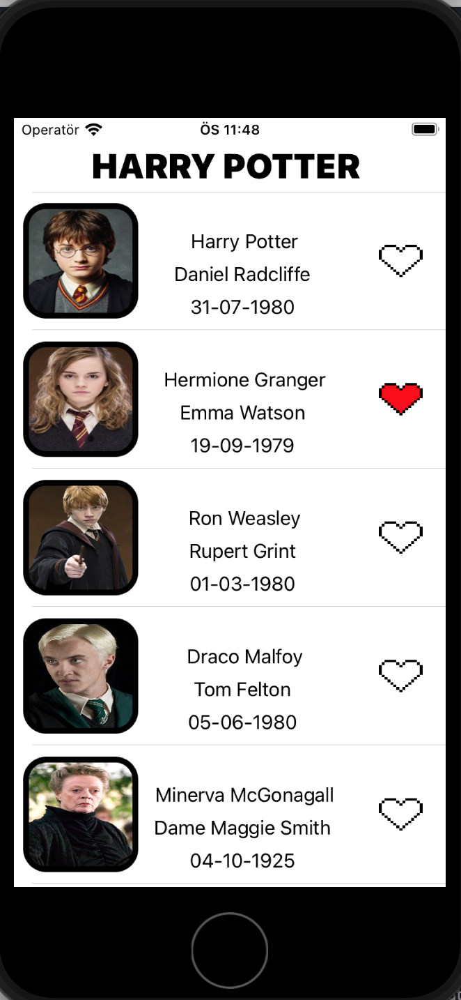
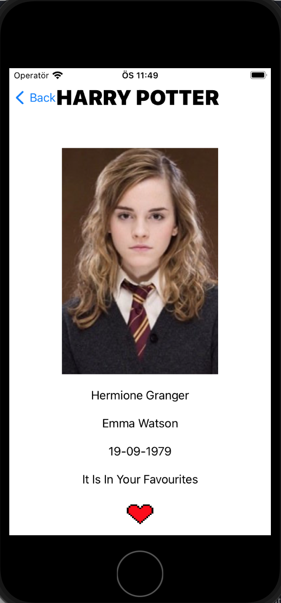

# pathodev1-MVVM

Bu uygualamada http://hp-api.herokuapp.com/api/characters sitesinden aldığımız json formatındaki Harry Potter karakterlerinin özelliklerini tableviewda listeliyoruz.Json datamızdan oyuncunun ismi karakterin ismi karakter resimi ve doğum yılı bilgilerini alıyoruz.Tableviewda bu özellikler dışında boş kalplerimiz var kullanıcı eğer bu kalplerden birine basarsa kalp bir animasyonla kırmızıya dönüyor ve Coredatamızda kalbin olduğu tableviewdaki karakter favorilere ekleniyor.Eğer bir tableviewa tıklarsak tıkladığımız tableviewdaki karakterin daha büyük resimi ve diğer bütün özellikleri başka bir sayfa da açılıyor.Bu sayfada da yine kalp ile coredata da favorilerimize bu karakteri ekleyebiliyoruz.Bu projede elimden geldiğince mvvm coordinator patteern kullanmaya çalıştım.Projede view, model, viewmodel,coredata procees(core data işlemleri için ) gibi dosyalar kullandım inceleyebilirsiniz.

# Uygulama Resimleri

# -1-

# -2-

